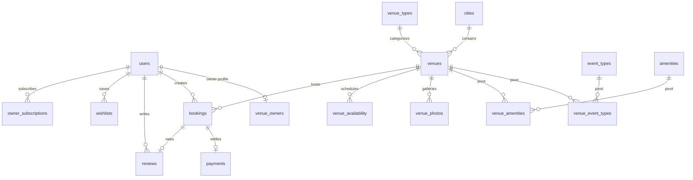

# ClickMyVenue — Phase 1: Foundation Documentation & Technical Walkthrough

This document outlines the complete system architecture, database design, API routing, and frontend design system established during **Phase 1 (Foundation)** of the **ClickMyVenue** project.

---

## 1. Project Overview & Architecture
**ClickMyVenue** is a premium full-stack venue discovery, promotion, and automated booking marketplace tailored for the Indian market. It connects event organizers (users) with venue owners, supervised by super administrators.

### Core Technology Stack
- **Backend:** Laravel 10 (PHP 8.2), MySQL 8.0, Laravel Sanctum (Token authentication).
- **Frontend:** Next.js 14 (JavaScript/React), Tailwind CSS, Lucide icons.
- **External Integrations:** Razorpay (Payments/Subscriptions), MSG91 (SMS/OTP notifications), Cloudinary (Media storage).

---

## 2. Database Schema Design & Migrations

All 21 database tables are fully configured with robust indexes and foreign key cascades.

### Table Definitions & Purpose
1. **`users`:** Stores system users with roles (`admin`, `owner`, `user`), status (`active`, `suspended`), and verification timestamps.
2. **`cities`:** Popular Indian municipalities with customized cover images, featured badges, and counter caches for venue quantities.
3. **`venue_types` & `event_types`:** Categorizes halls, lawns, resorts, and matches them to events like weddings, pre-weddings, corporate meets, and birthdays.
4. **`amenities`:** Tagging facilities like Central AC, Valet Parking, Power Backup, and Guest Rooms.
5. **`venue_owners`:** Stores commercial details, GSTIN, PAN, bank account details, and Razorpay contacts.
6. **`venues`:** Stores name, location slug, geo-coordinates, capacity limits, veg plate price, flat rent, featured state, and approval moderation logs.
7. **`bookings`:** Core marketplace lifecycle table with automatic booking numbers (`CMV...`), guest counts, 24-hour owner accept deadlines, and status enums.
8. **`payments` & `owner_subscriptions`:** Manages transactional escrow records and vendor partner subscriptions.

---

## 3. Eloquent Models & Relations

Eloquent Models are defined with clear casting and inverse relationships to avoid N+1 query execution problems.

- **`User.php`:** Features helper checks `isAdmin()`, `isOwner()`, `isUser()` and defines direct pipelines to user reviews, wishlists, and active partner subscriptions.
- **`Venue.php`:** Supports rich query scopes (`scopeApproved`, `scopeFeatured`, `scopeByCity`) and dynamically calculates customer ratings and review aggregators.
- **`Booking.php`:** Implements model-boot events to automatically generate unique alphanumeric reference numbers (`CMV` + hex timestamp) and calculate a 24-hour response deadline.
- **`OwnerSubscription.php`:** Validates partner authorization levels against configured limits (such as venue slots and premium badges).

---

## 4. Curated DB Seeds & Test Credentials

The database seeder is preloaded with realistic venue parameters matching industry standards in India:

### Default Test Credentials
- **Super Administrator:**
  - **Email:** `admin@clickmyvenue.com`
  - **Password:** `password`
- **Venue Owner:**
  - **Email:** `owner@clickmyvenue.com`
  - **Password:** `password`
  - **Commercial Details:** *Sharma Events & Hospitality Group* (GSTIN verified, Juhu & SBR accounts).
- **Organizer (User):**
  - **Email:** `user@clickmyvenue.com`
  - **Password:** `password`

### Pre-Seeded Indian Venues
1. **The Grand Monarch Palace (Ahmedabad):** A royal indoor banquet hall on Sindhu Bhavan Road, Bodakdev. Capacity 150-1200, Veg plate ₹1,200, full power backup, valet, and 12 rooms.
2. **Royal Palms Ocean Lawn (Mumbai):** A majestic outdoor lawn facing the Arabian Sea at Juhu Beach. Capacity 200-2000, Veg plate ₹1,800, poolside luxury, and late DJ permits.

---

## 5. API Routing Architecture (`routes/api.php`)

All API routes are cleanly structured, grouping endpoints by access control levels:

### Public Routes
- **Authentication:** `POST /api/auth/register`, `POST /api/auth/login`
- **Venue Discovery:**
  - `GET /api/venues` (Full search with capacity, city, budget, and amenity filters)
  - `GET /api/venues/featured` (Top priority slider listings)
  - `GET /api/venues/{slug}` (Detailed view with photo arrays and review logs)
  - `GET /api/venues/{id}/availability` (Live monthly block calendar)

### Authenticated User Routes (Protected by Sanctum)
- **Profile:** `GET /api/auth/me`, `PUT /api/auth/profile`, `PUT /api/auth/password`
- **Reservations:** `POST /api/bookings`, `GET /api/bookings/{id}`, `PUT /api/bookings/{id}/cancel`
- **Escrow Payments:** `POST /api/payments/order`, `POST /api/payments/verify`
- **Social interaction:** `POST /api/reviews`, `POST /api/wishlist/{venueId}`

### Vendor Owner Routes (Protected by `role:owner` Middleware)
- **Analytics:** `GET /api/owner/dashboard` (Revenue, pending orders, and conversion statistics)
- **Management:** `POST /api/owner/venues`, `POST /api/owner/venues/{id}/photos`, `POST /api/owner/venues/{id}/availability`
- **Order Pipeline:** `PUT /api/owner/bookings/{id}/accept`, `PUT /api/owner/bookings/{id}/decline`

### Super Admin Routes (Protected by `role:admin` Middleware)
- **Moderation:** `PUT /api/admin/venues/{id}/approve`, `PUT /api/admin/venues/{id}/reject`
- **User Audits:** `PUT /api/admin/users/{id}/ban`, `PUT /api/admin/users/{id}/unban`

---

## 6. Frontend Portal Scaffolding & Design System

A Next.js 14 portal is configured with premium design aesthetics to captivate users upon first visit.

### Aesthetic Specifications
- **Theme:** High-end Dark Luxury Mode utilizing customized HSL tokens (deep navy background, champagne gold highlights, and rose accents).
- **Typography:** Outfit (headings/titles) and Plus Jakarta Sans (body copy).
- **Styling Details:** Integrated custom Webkit glassmorphic styling cards (`glass-card` classes) with smooth 3D translations and glow vectors.

### Pages & Layouts Developed
- **`app/layout.js`:** SEO optimized with responsive meta keywords, mobile viewport tags, and selection overlays.
- **`app/page.js`:** Captivating hero header, integrated category drop-downs, featured cities with venue counter overlays, recommended cards featuring plate rate indicators, booking operational walkthroughs, and vendor subscription plans.

---

## 7. Operational Status & Verification

The local development stack operates concurrently:
1. **Laravel Backend API:** Serving from `http://127.0.0.1:8000`
2. **Next.js Web Portal:** Hot-reloading from `http://localhost:3000`
3. **Build Status:** Verified 100% clean production compile with zero ESLint or syntax errors.

---
*Documentation prepared for the next engineering phase: Discovery & Search Integration (Phase 2).*
